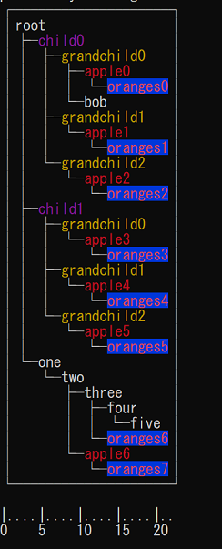

# gree [](https://pkg.go.dev/github.com/rendicott/gree)
Build nodes with children and display them like the classic `tree` command shows dirs



# Example
```
package main

import (
	"fmt"

	"github.com/rendicott/gree"
)

func main() {
	a := gree.NewNode("root")
	a.NewChild("child1").NewChild("grandchild1")
	a.NewChild("child2").NewChild("grandchild2")
	a.NewChild("child3").NewChild("grandchild3")
	a.NewChild("child4")
	a.NewChild("child5")
	// add child to 1st grandchild of 2nd child of root
	a.GetChild(1).GetChild(0).NewChild("whoops")

	// integrate a new tree
	b := gree.NewNode("extended")
	b.NewChild("puppy1").NewChild("grandpuppy1")
	b.NewChild("puppy2").NewChild("grandpuppy2")

	a.GetChild(2).AddChild(b)

	fmt.Println(a.Draw())
}
```

Outputs:

```
root
├── child1
│   └── grandchild1
├── child2
│   └── grandchild2
│       └── whoops
├── child3
│   ├── grandchild3
│   └── extended
│       ├── puppy1
│       │   └── grandpuppy1
│       └── puppy2
│           └── grandpuppy2
├── child4
└── child5
```

More examples can be found in [./examples](./examples).